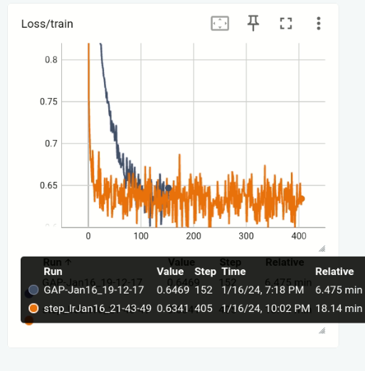

# Capstone - ERA Phase I 

## Goals 
1. Demonstrate training a LLM from scratch 
2. Build a Multi-Modal (Image, Audio, Text) LLM 
3. Create a HuggingFace App to use the Multi-Modal LLM 
4. Write a full description of the project as well as areas of improvement 

## Results 
1. Demonstrate training a LLM from scratch 
    1. Dataset: https://huggingface.co/datasets/togethercomputer/RedPajama-Data-1T-Sample
    2. Model: https://huggingface.co/microsoft/phi-2
    3. Notebook: ./capstone_stage_0_train_phi2_scratch.ipynb
    4. Description: The notebook shows the logs for training Microsoft's Phi-2 model from scratch using a subset of the togethercomputer/RedPajama-Data-1T-Sample dataset.

2. Build a Multi-Modal (Image, Audio, Text) LLM
    1. Mode: Image 
        1. Store CLIP embeddings for COCO/train2017 dataset. 
            1. Notebook: ./capstone_stage_1_get_CLIP_embeddings.ipynb
            2. Dataset: https://cocodataset.org/
            3. Description: Pass the COCO images through CLIP (openai/clip-vit-base-patch32) This will give us an embedding of shape 50, 768. We romve the cls token and store the 49, 768 embedding for each image. 
        2. Train a projection layer with a frozen Microsoft Phi-2 to convert CLIP embeddings to an equivalent Microsoft Phi-2 embedding. 
            1. Notebook: ./capstone_stage_1_projectionlayer_train_phi2.ipynb
            2. Dataset: https://cocodataset.org/, CLIP embeddings from Step 1. 
            3. Description: Phi2wrapper is a module that takes the CLIP embeddings and uses a trainable projection layer to convert to Phi-2 embedding space. To do this we limited the captions from the COCO dataset to max of 30 tokens and also use only 1 caption per image to save compute time. The frozen Phi-2 was loaded in float16 to save memory. For training we passed in Phi-2 embedding space: "Image: " + image_embedding from projection layer + "Caption this: " to Phi-2. Using partial feature forcing for the first 3 tokens we trained the model to predict the next word in the caption. 
            4. Logs: The logs for training are present in the notebook. 
    2.Mode: Text 
        1. Description: No further training is required for Text input since it can be pushed to embedding space using pre-trained Microsoft-Phi-2. 
    3. Mode: Audio
        1. Model: https://github.com/m-bain/whisperX
        2. Description: To transcribe an Audio input WhisperX was used. It can very accurately and speedily convert an Audio to Text. After transcribe and processing the format to get a simple text we can treat this mode as equivalent to mode B. (Text)
    4. Fine-tuning to become a Question-Answer LLM 
        1. Dataset: https://huggingface.co/datasets/liuhaotian/LLaVA-Instruct-150K
        2. Notebook: ./capstone_stage_2_finetune_QLora.ipynb
        3. Description: We want to build a model that can answer questions given context in form of an Image/Audio/Text. To do this we need to fine-tune our Phi2wrapper so that it adds adaptors to the Phi2 part and finetunes the projection layer part. Using peft we add adaptors. I limited the max number of tokens in both the question and answers to save gpu memory space. Since I couldn't hack dynamic padding in time, I kept the batch size = 1 and trained for as many epochs as I could. Feature forcing on the answer tokens was removed since this model already has gone through learning in part A. Step 2. For the projection layer the weights are initialized using the part A. Step 2 where only the projection layer was trained. Here the input to the model was "Context: " + image embeddings from the trained projection layer + " Question: " + embeddings of the question from the dataset  + " Answer: ". The model was made to predict the answer which was compared with the gt from the dataset. 
        4. Logs: The training logs are shown in the notebook. 
    
    5. Integration 
        1. Notebook: ./capstone_stage_2_integrate.ipynb
        2. Description: This notebook contains functions to integrate our fine-tuned model with other modalities. To do this simply the input to the fine-tuned model becomes "Context: " embeddings from image, audio, text + " Question: " + user query + " Answer: ". The generate function is used to generate the answer. 
        
3. Create a HuggingFace App to use the Multi-Modal LLM 
    1. Notebook: ./capstone_stage_2_integrate.ipynb
    2. Description: A gradio app to use the built Multi-Modal LLM
    3. Link: 

4. Areas of improvement / Things to experiment. 
    1. I wanted to test if the embedding from CLIP can directly be trained to map to embedding of Phi-2. So to go from [1, 49, 768] to [1, 49, 2560] without the use of Phi-2. 
        Notebook: ./capstone_stage_1_test_projectionlayer_direct_CLIP_NN.ipynb
        Description: A simple NN to convert a [1, 49, 768] to [1, 49, 2560]. I tried to run this model but without success. The loss function was cosine distance between the target [1, 49, 2560] and prediction from the NN also of shape [1, 49, 2560]. From preliminary results it looked like this model was too simple and the cosine distance did not reduce below 0.65-ish. 
        
    2. Often during training, a problem arose that even if the words weren't exactly the same the sentence made semantic sense. So a line of investigation was to test if the loss function can have an element of whether or not the predicted sentence and the target sentence are semantically similar. 

Contributors
-------------------------
Lavanya Nemani

Shashank Gupta

Darshat Shah 
