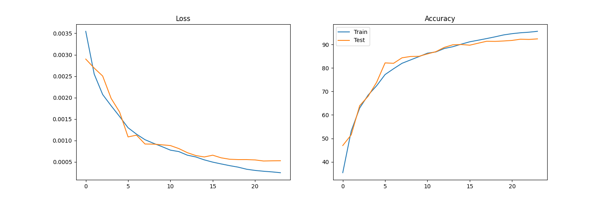
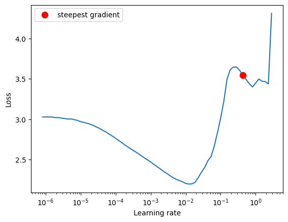

# Session 10 - ERA Phase I - Assignment 

## Goals 
1. Accuracy of 90% 
2. Custom ResNet model training with OneCycle LR policy. 
3. Modular code and specific image augmentations. 

## Usage 
1. custom_resent.py contains the ResNet model used. 
2. utils.py contains various functions for visualization, information on devices etc. 
3. main.py contains the training function.
4. lr_finder contains the function to optimize lr rates. 
3. S10.ipynb is the notebook used to train the model. 

## Results 

Training/Test Accuracy: 95.60%, 92.37%

Lr finder
