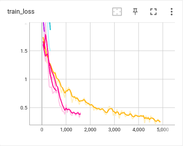
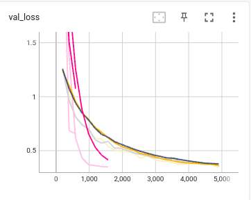
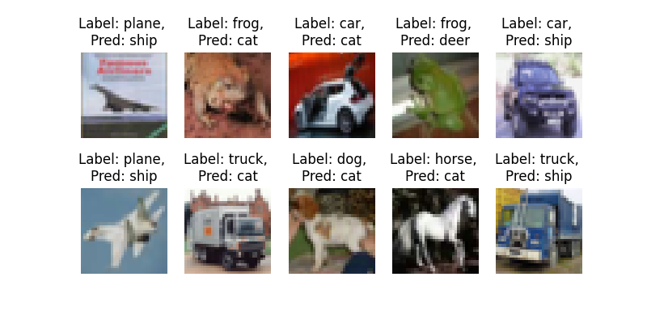

# Session 12 - ERA Phase I - Assignment 

## Goals 
1. Shift S10 code to PyTorch Lightning
2. Use Gradio to create UI
3. Build app on HuggingFace

## Usage 
1. S12.ipynb shows the PyTorch Lightning code for the custom ResNet from S10
2. S12-HuggingFace.ipynb shows the gradio app tested on colab to be shifted to app.py in HuggingFace Spaces (App is here: https://huggingface.co/spaces/LN1996/S12-ERA-Phase-I)
3. utils.py contains functions for transforms and class for Cifar10 dataset, functions for finding and plotting misclassified images. 

## Results
1. Logs (from PyTorch Lightning)
Epoch 24: 100%
196/196 [00:28<00:00, 6.94it/s, v_num=18, train_loss=0.306, val_loss=0.359]

2. Loss (Train/Val) --> Generated through tensorboard

3. Misclassified images 

