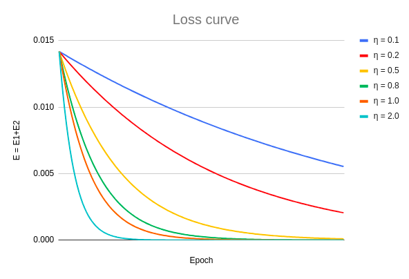

# Session 6 - ERA Phase I - Assignment 

## Goals 
1. Perform Backprop for a simple NN using excel and see the changes in the loss curve with changes in the learning rate. 
2. Re-write the model architecture to achieve 99.4% accuracy within 20k model parameters having used BN, Dropout within 20 epochs. 

## Usage 
1. model.py contains the model class Net(). 
2. utils.py contains various functions for visualization, information on devices etc. 
3. S6.ipynb is the notebook that uses model.py and utils.py files for training on MNIST dataset for image classification. 

## Results 
1. The loss curves for different learning rates [0.1, 0.2, 0.5, 0.8, 1.0, 2.0] can be seen below. 

2. S6.ipynb contains the log for training which show we were able to achieve the 99.4% accuracy mark within the 20 epochs. The model.py file shows our modified network which uses less than 20k model parameters, BN and Dropout (with value of 0.1), GAP and ReLU. 
