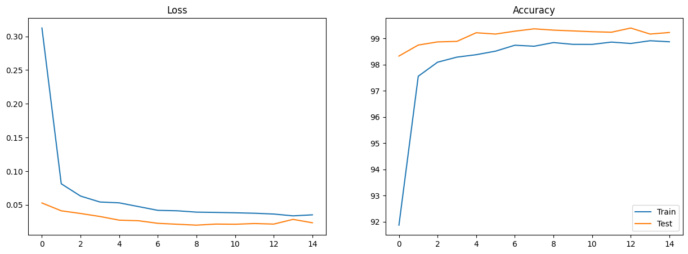
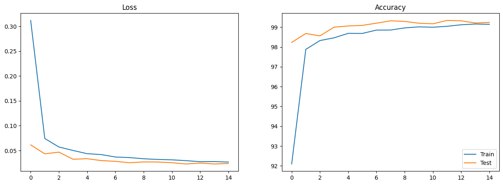
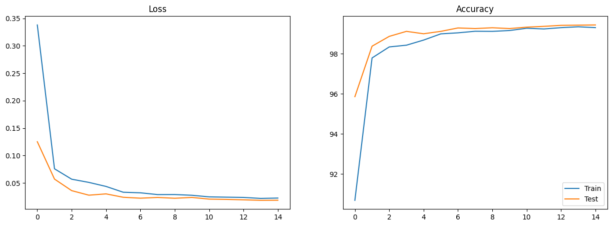

# Session 7 - ERA Phase I - Assignment 

## Goals 
1. Achieve 99.4% accuracy with the MNIST dataset
2. Less than or equal to 15 Epochs
3. Less than 8000 Parameters

## Usage 
1. model.py contains the different models used. 
2. utils.py contains various functions for visualization, information on devices etc. 
3. S7\_A.ipynb, S7\_B.ipynb, S7\_C.ipynb are the notebooks using the different models in model.py

## Results 
1. With Net\_A
    Target --> Less than 8k param
    Results --> Params: 7,544
    Analysis --> Under-fitting (Test accuracy < Train accuracy)
    Currently using dropout value of 0.05. Next iteration, we remove dropout.

2. With Net\_B 
    Target --> Counter underfitting from Net_A
    Results --> Params: 7,544, Droputout value = 0, StepLR changes every 5 epochs
    Analysis --> Consistently achieves 99.4% accuracy for test loss, but still overfitting.
    Next we will try to slightly increase the number of parameters to reach the 8k mark.

3. With Net\_C 
    Target --> Counter underfitting from Net_B, covenrgence problem.
    Results --> Params: 7,974, Droputout value = 0, slightly increase params.
    Analysis --> Almost negligible overfitting now. Consitent 99.4% accuracy in the last epochs!

