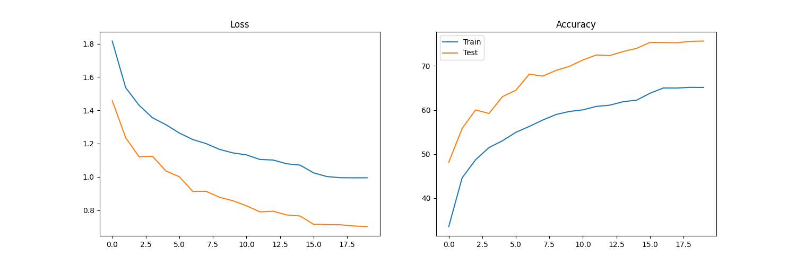
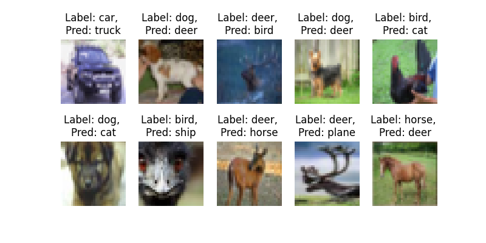
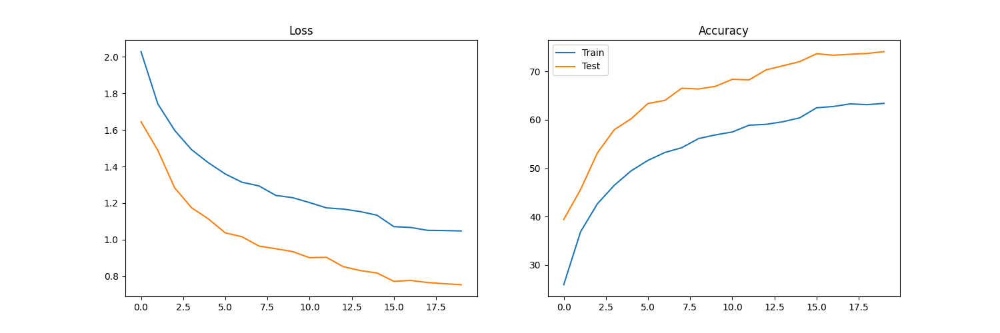
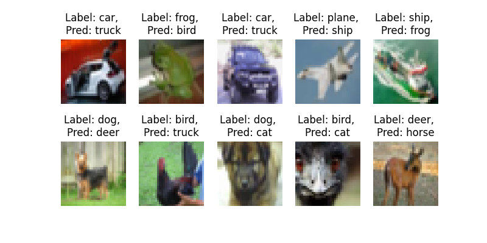
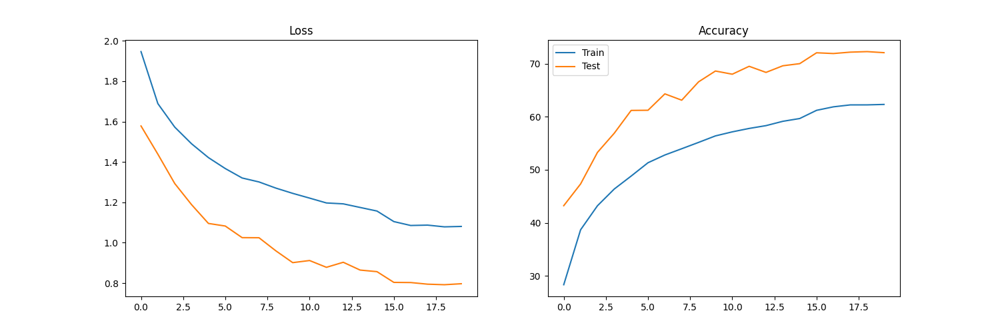
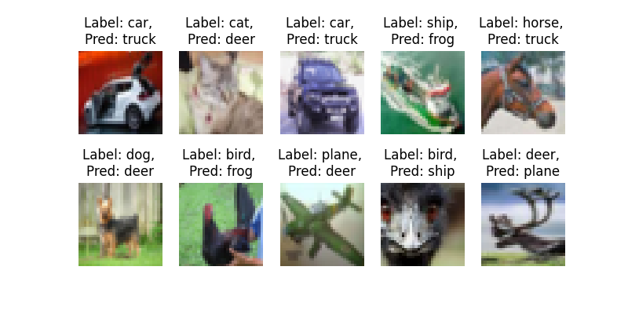

# Session 8 - ERA Phase I - Assignment 

## Goals 
1. Achieve 70% accuracy with the CIFAR10 dataset
2. Less than or equal to 20 Epochs
3. Less than 50000 Parameters
4. Use Batch, Layer and Group Normalization techniques. 
5. Use ResNet like skip conenctions!

## Usage 
1. model.py contains the different models used. 
2. utils.py contains various functions for visualization, information on devices etc. 
3. S8.ipynb is the notebook used to train the models with BN, LN, GN. 

## Results 

From these results, we can conclude that for smaller datasets like CIFAR10, BN >> LN >> GN. 

1. With BN 
Training/Test Accuracy: 65.12%, 75.64%

2. With LN
Training/Test Accuracy: 63.40%, 74.08%

3. With GN 
Training/Test Accuracy: 62.33%, 72.09%

