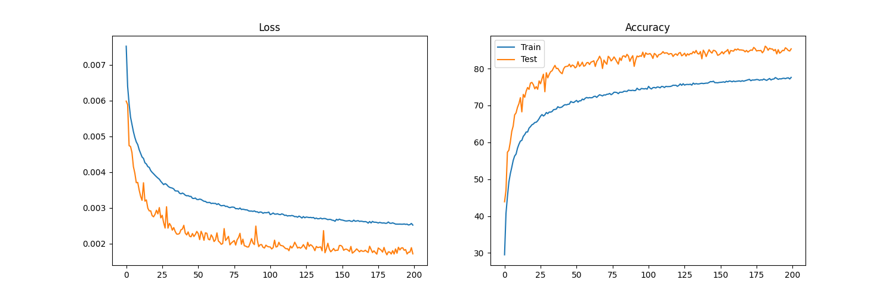
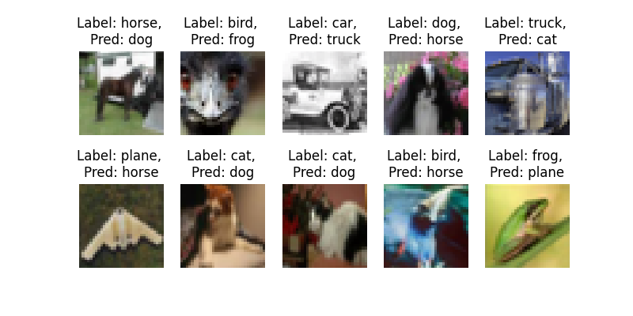

# Session 9 - ERA Phase I - Assignment 

## Goals 
1. Achieve 85% accuracy with the CIFAR10 dataset
3. Less than 200k Parameters, RF > 44.
4. Use Depthwise, Dilated, GAP.  
5. Apply augmentation techniques. 

## Usage 
1. model.py contains the different models used. 
2. utils.py contains various functions for visualization, information on devices etc. 
3. S9.ipynb is the notebook used to train the model. 

## Results 

Training/Test Accuracy: 77.61%, 85.36%

